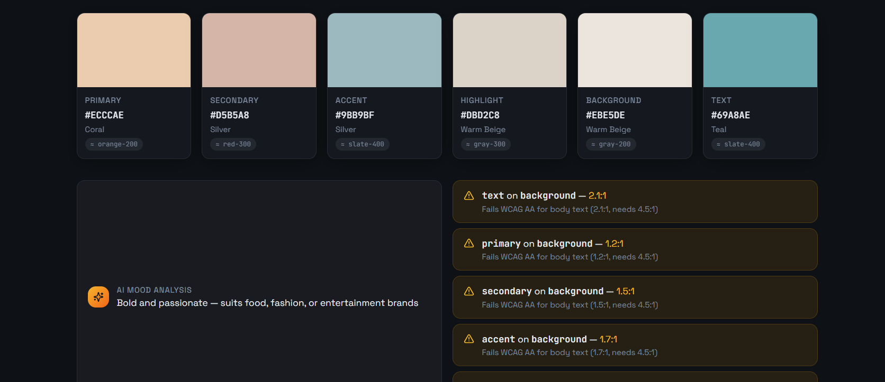
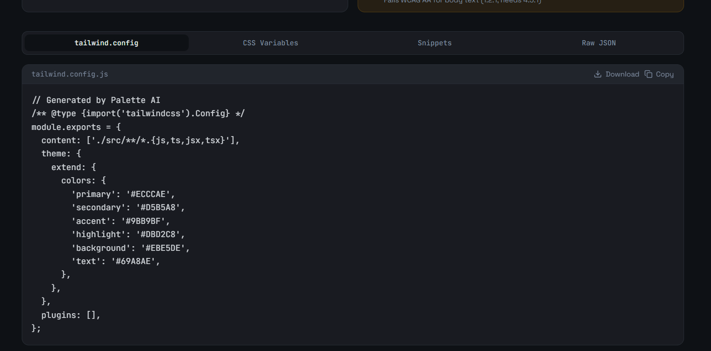

<div align="center">

# API Hook Builder

**Convert any JSON API endpoint into production-ready React hooks and TypeScript types in seconds.**

[](https://opensource.org/licenses/MIT)
[](#)
[](https://www.typescriptlang.org/)
[](https://reactjs.org/)

[Live Demo](#) • [Documentation](#) • [Report Bug](#) • [Request Feature](#)

</div>

---

##  Demo





> **Visual proof matters more than text.**

- **Live App:** [yourapp.com](https://yourapp.com)
-  **Demo Video:** [Watch on YouTube](https://youtube.com/...)

---

##  The Problem

Working with modern APIs often involves tedious, repetitive tasks that are prone to errors:
-  **Writing TypeScript types** for every endpoint response.
-  **Creating fetch wrappers** or service layers manually.
-  **Writing TanStack/React Query hooks** for state management.

This slows down development and introduces bugs when the API schema changes.

---

##  The Solution

**API Hook Builder** bridges the gap between your API and your React application. Just paste a JSON endpoint or response, and it instantly generates:

-  **Fully Typed TypeScript Interfaces**: No more `any` or manual interface definitions.
-  **Production-Ready Fetch Client**: Robust, modular service layer.
-  **TanStack React Query Hooks**: Pre-configured with best practices for caching and synchronization.

---

##  Features

- **JSON → TypeScript**: Automatic generation of complex interfaces from JSON samples.
- **Nested Structures**: Full support for deeply nested objects and arrays.
- **Hook Generation**: Generates clean `useQuery` and `useMutation` hooks.
- **Copy-Ready Code**: No extra setup required—just copy, paste, and ship.
- **No CLI Required**: A purely browser-based tool for maximum accessibility.

---

##  Tech Stack

### Frontend
- **Framework**: [React](https://reactjs.org/)
- **Language**: [TypeScript](https://www.typescriptlang.org/)
- **Styling**: [Tailwind CSS](https://tailwindcss.com/)

### Backend
- **Runtime**: Node.js
- **Framework**: Express

### Other
- **State Management**: [TanStack Query](https://tanstack.com/query/latest) (React Query)
- **Icons**: [Lucide React](https://lucide.dev/)
- **Animations**: [Framer Motion](https://www.framer.com/motion/)

---

##  Quick Start

Get the project running locally in under 60 seconds:

1. **Clone the repository**
   ```bash
   git clone https://github.com/biswajit-sarkar-007/api-hook-builder.git
   ```

2. **Install dependencies**
   ```bash
   npm install
   ```

3. **Run the development server**
   ```bash
   npm run dev
   ```

---

##  Project Structure

```text
src/
 ├─ components/     # Reusable UI components
 ├─ hooks/          # Custom generator hooks
 ├─ services/       # Core generation logic
 ├─ utils/          # Utility functions
 └─ pages/          # Application views & routing
```

---

##  How It Works

This is where the engineering credibility lives:

1. **Fetch JSON from endpoint**: Gracefully handles cross-origin requests or pasted blobs.
2. **Parse object schema**: Recursively traverses the JSON to build a metadata map.
3. **Generate TypeScript types**: Maps JSON types to valid TypeScript syntax.
4. **Generate React Query hook**: Wraps the generated types and fetch calls into a standard TanStack pattern.

---

##  Roadmap

- [x] JSON → TypeScript generation
- [x] TanStack React Query hooks support
- [ ] GraphQL schema introspection support
- [ ] CLI version for CI/CD pipelines
- [ ] VSCode extension for inline generation

---

## Contributing

Contributions make the open-source community an amazing place to learn, inspire, and create. Any contributions you make are **greatly appreciated**.

1. Fork the Project
2. Create your Feature Branch (`git checkout -b feature/AmazingFeature`)
3. Commit your Changes (`git commit -m 'Add some AmazingFeature'`)
4. Push to the Branch (`git push origin feature/AmazingFeature`)
5. Open a Pull Request

---

##  License

Distributed under the MIT License. See `LICENSE` for more information.
